<!------------------------------------------------------------------------------------------------------------------------->
<div style="position: fixed; top: 0; left: 0; width: 100%; height: 100%; font-size: 50px; color: rgba(0,0,0,0.05); transform: rotate(-33deg); display: flex; font-weight: bold;flex-wrap: wrap; align-content: center; justify-content: center; pointer-events: none;">LinkedIn · @AshishZope</div>
<div style="position: fixed; top: 0; left: 0; width: 100%; height: 100%; pointer-events: none; display: flex; align-items: center; justify-content: center; transform: rotate(0deg);"></div>
<div style="position: fixed; inset: 0; background-image: url('watermark.png'); background-repeat: repeat; background-size: 280px; opacity: 0.02; transform: rotate(-33deg); pointer-events: none;"></div>

<style>.line { display: block; position: relative; padding-right: 160px; line-height: 1.6;}.line::after { content: "LinkedIn · @AshishZope"; position: absolute; right: 0; bottom: 0; font-size: 9px; font-weight: 500; letter-spacing: 1.1px; color: rgba(0, 0, 0, 0.5); white-space: nowrap; user-select: none; pointer-events: none; }</style>

<!------------------------------------------------------------------------------------------------------------------------->

<!------------------------------------------------------------------------------------------------------------------------->

<style>
/* Modern Azure-themed header styling */
.modern-header {
  background: linear-gradient(135deg, #0078D4 0%, #005A9E 50%, #003F7A 100%);
  color: white;
  text-align: center;
  font-size: 3em;
  font-weight: 700;
  margin: 20px 0 10px 0;
  letter-spacing: 2px;
  font-family: 'Segoe UI', -apple-system, BlinkMacSystemFont, sans-serif;
  text-shadow: 2px 2px 4px rgba(0,0,0,0.3);
  border-radius: 15px;
  padding: 30px 20px;
  box-shadow: 0 8px 32px rgba(0,120,212,0.3);
  position: relative;
  overflow: hidden;
}

.modern-header::before {
  content: '';
  position: absolute;
  top: 0;
  left: -100%;
  width: 100%;
  height: 100%;
  background: linear-gradient(90deg, transparent, rgba(255,255,255,0.1), transparent);
  animation: shimmer 3s infinite;
}

@keyframes shimmer {
  0% { left: -100%; }
  100% { left: 100%; }
}

.modern-header .highlight {
  color: #00BCF2;
  text-shadow: 0 0 20px rgba(0,188,242,0.5);
  position: relative;
}

.modern-header .subtitle {
  font-size: 0.4em;
  font-weight: 300;
  letter-spacing: 1px;
  margin-top: 10px;
  opacity: 0.9;
}

/* Enhanced document styling */
body {
  font-family: 'Segoe UI', -apple-system, BlinkMacSystemFont, 'Roboto', sans-serif;
  line-height: 1.6;
  color: #333;
}

h1, h2, h3, h4, h5, h6 {
  color: #0078D4;
  font-weight: 600;
  margin-top: 30px;
  margin-bottom: 15px;
}

h2 {
  border-bottom: 3px solid #00BCF2;
  padding-bottom: 10px;
  font-size: 1.8em;
}

h3 {
  color: #005A9E;
  font-size: 1.4em;
}

code {
  background-color: #f8f9fa;
  border: 1px solid #e9ecef;
  border-radius: 4px;
  padding: 2px 6px;
  font-family: 'Consolas', 'Monaco', 'Courier New', monospace;
  font-size: 0.9em;
}

pre {
  background-color: #f8f9fa;
  border: 1px solid #e9ecef;
  border-radius: 8px;
  padding: 15px;
  overflow-x: auto;
  box-shadow: 0 2px 8px rgba(0,0,0,0.1);
}

pre code {
  background: none;
  border: none;
  padding: 0;
}

table {
  border-collapse: collapse;
  width: 100%;
  margin: 20px 0;
  box-shadow: 0 2px 8px rgba(0,0,0,0.1);
  border-radius: 8px;
  overflow: hidden;
}

th, td {
  border: 1px solid #ddd;
  padding: 12px 15px;
  text-align: left;
}

th {
  background: linear-gradient(135deg, #0078D4, #005A9E);
  color: white;
  font-weight: 600;
  text-transform: uppercase;
  font-size: 0.9em;
  letter-spacing: 0.5px;
}

tr:nth-child(even) {
  background-color: #f8f9fa;
}

tr:hover {
  background-color: #e3f2fd;
  transition: background-color 0.3s ease;
}

blockquote {
  border-left: 4px solid #00BCF2;
  background-color: #f8f9fa;
  padding: 15px 20px;
  margin: 20px 0;
  border-radius: 0 8px 8px 0;
  font-style: italic;
}

.line {
  display: block;
  position: relative;
  padding-right: 160px;
  line-height: 1.6;
}

.line::after {
  content: "LinkedIn · @AshishZope";
  position: absolute;
  right: 0;
  bottom: 0;
  font-size: 9px;
  font-weight: 500;
  letter-spacing: 1.1px;
  color: rgba(0, 0, 0, 0.5);
  white-space: nowrap;
  user-select: none;
  pointer-events: none;
}
</style>

<div class="modern-header">
  <div>Azure Data Factory</div>
  <div class="highlight">(ADF)</div>
  <div class="subtitle">Cloud Data Integration Service</div>
</div>

# Table of Contents

1. Introduction to Azure Data Factory
2. Why Use ADF
3. Core Concepts of ADF
4. ADF Architecture
5. Azure Data Factory Components
6. Azure Portal Basics
7. Creating Azure Free Account
8. Creating Azure Data Factory Instance
9. Understanding Integration Runtime
10. Linked Services
11. Datasets
12. Pipelines
13. Activities in ADF
14. Copy Data Activity
15. Data Flow
16. Control Flow Activities
17. Parameters and Variables
18. Expressions and Dynamic Content
19. Triggers
20. Monitoring and Debugging
21. Error Handling
22. Incremental Load
23. Full Load
24. ETL vs ELT in ADF
25. Connecting Different Data Sources
26. SQL Integration with ADF
27. File Handling in ADF
28. REST API Integration
29. Scheduling Pipelines
30. CI/CD in ADF
31. Git Integration
32. ARM Templates
33. Security in ADF
34. Managed Identity
35. Role-Based Access Control (RBAC)
36. Azure Key Vault Integration
37. Performance Optimization
38. Logging and Monitoring
39. Data Lake Integration
40. Synapse Integration
41. Databricks Integration
42. Snowflake Integration
43. SAP Integration
44. Real-Time Scenarios
45. End-to-End Projects
46. Best Practices
47. Common Interview Questions
48. ADF Developer Roadmap
49. ADF Naming Standards
50. Important Terminologies
51. Common Errors and Fixes
52. Certification Guidance
53. Troubleshooting and Common Issues
54. Advanced Topics and Future Trends
55. Learning Resources
56. Conclusion

---

# 1. Introduction to Azure Data Factory

Azure Data Factory (ADF) is Microsoft's fully managed, cloud-based data integration service that enables you to create, schedule, and orchestrate data pipelines for ETL (Extract, Transform, Load) and ELT (Extract, Load, Transform) workflows.

## Key Capabilities

- **Data Movement**: Copy data between 100+ data stores at scale
- **Data Transformation**: Transform data using visual data flows or compute services
- **Orchestration**: Schedule and monitor complex data workflows
- **Hybrid Integration**: Connect to on-premises and cloud data sources
- **Code-Free Development**: Low-code/no-code interface with visual authoring

## Real-World Use Cases

- **Data Warehousing**: Loading operational data into Azure Synapse Analytics
- **Data Lake Ingestion**: Processing streaming data into Azure Data Lake Storage
- **API Integration**: Ingesting data from REST APIs into databases
- **Cross-Cloud Analytics**: Moving data between AWS, GCP, and Azure
- **Real-Time Processing**: Event-driven data pipelines with Azure Event Grid

## Example Architecture

```
┌─────────────────┐    ┌─────────────────┐    ┌─────────────────┐
│   Source        │───▶│   ADF Pipeline  │───▶│   Destination   │
│   Systems       │    │   Activities    │    │   Systems       │
│                 │    │                 │    │                 │
│ • SQL Server    │    │ • Copy Data     │    │ • Azure SQL DB  │
│ • REST APIs     │    │ • Data Flow     │    │ • Data Lake     │
│ • Blob Storage  │    │ • Stored Proc   │    │ • Synapse       │
│ • On-Premises   │    │ • Web Activity  │    │ • Snowflake     │
└─────────────────┘    └─────────────────┘    └─────────────────┘
```

## Target Audience

- **Data Engineers**: Design and implement data pipelines
- **BI Developers**: Build data transformation workflows
- **Cloud Architects**: Design enterprise data architectures
- **Analytics Teams**: Prepare data for reporting and ML
- **DevOps Engineers**: Implement CI/CD for data pipelines

---

# 2. Why Use ADF

## Advantages of ADF

### Scalability & Performance
- **Elastic Compute**: Auto-scale based on workload demands
- **Parallel Processing**: Execute multiple activities simultaneously
- **Data Integration Units (DIU)**: Scale compute power from 2 to 256 DIUs
- **Global Distribution**: Deploy factories in 40+ Azure regions

### Cost Optimization
- **Pay-per-Use**: Only pay for actual data movement and execution time
- **Serverless**: No infrastructure management costs
- **Reserved Instances**: Up to 65% savings with 1-year reservations
- **Auto-Pause**: Automatically pause pipelines to reduce costs

### Security & Compliance
- **Enterprise Security**: SOC 2, HIPAA, GDPR compliant
- **Encryption**: Data encrypted at rest and in transit
- **Managed Identity**: Passwordless authentication
- **Private Endpoints**: Secure connectivity without public IPs

### Developer Experience
- **Visual Authoring**: Drag-and-drop pipeline design
- **Code Integration**: ARM templates, PowerShell, .NET SDK
- **Git Integration**: Source control with Azure DevOps/GitHub
- **CI/CD Support**: Automated deployment pipelines

## Real-Time Use Cases with Examples

### E-Commerce Data Pipeline
```
Daily Sales Data Flow:
Shopify API → ADF Pipeline → Azure SQL DB → Power BI Reports
- Extract orders via REST API
- Transform currency and dates
- Load into dimensional model
- Trigger Power BI dataset refresh
```

### Financial Services
```
Banking Transaction Processing:
On-prem Oracle DB → Self-Hosted IR → Azure Synapse → Compliance Reports
- Incremental load of transactions
- Data validation and cleansing
- Load into data warehouse
- Generate regulatory reports
```

### IoT Analytics
```
Sensor Data Ingestion:
IoT Hub → Event Grid → ADF Pipeline → Data Lake → Databricks
- Real-time event triggers
- Batch processing of sensor data
- Store in Parquet format
- ML model scoring pipeline
```

### Healthcare Data Integration
```
Patient Records Pipeline:
EHR Systems → ADF → Azure SQL DB → Azure Analysis Services
- HIPAA-compliant data movement
- Patient data de-identification
- Load into analytics database
- Power BI embedded reports
```

---

# 3. Core Concepts of ADF

## Main Building Blocks

| Component | Description | Example |
|-----------|-------------|---------|
| **Pipeline** | Logical grouping of activities that perform a unit of work | `PL_Daily_Sales_Load` - Orchestrates data extraction, transformation, and loading |
| **Activity** | Single processing step within a pipeline | `Copy_Orders_From_API` - Copies data from REST API to Azure SQL |
| **Dataset** | Named reference to data structure | `DS_Orders_JSON` - Points to JSON files in Blob Storage |
| **Linked Service** | Connection definition with authentication | `LS_SQLDW_Prod` - Connection string to Azure Synapse Analytics |
| **Trigger** | Mechanism to execute pipelines | `TR_Hourly_Data_Load` - Runs pipeline every hour |
| **Integration Runtime** | Compute infrastructure for data movement | `IR_Azure_AutoResolve` - Serverless compute for cloud data |
| **Data Flow** | Visual data transformation engine | `DF_Cleanse_Customer_Data` - Transforms raw customer data |

## Pipeline Execution Flow

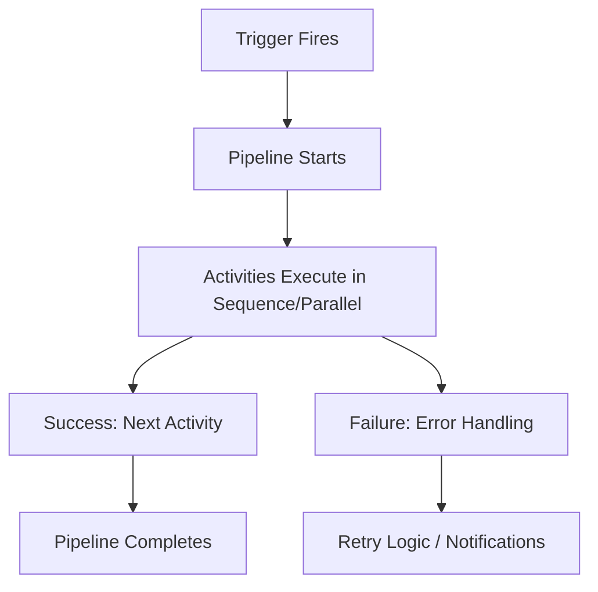

## Example: Complete Pipeline Structure

```json
{
  "name": "PL_Process_Sales_Data",
  "properties": {
    "activities": [
      {
        "name": "Copy_Raw_Sales",
        "type": "Copy",
        "inputs": [{"referenceName": "DS_Sales_CSV"}],
        "outputs": [{"referenceName": "DS_Staging_SQL"}]
      },
      {
        "name": "Validate_Data",
        "type": "SqlServerStoredProcedure",
        "linkedServiceName": {"referenceName": "LS_SQL_Server"}
      },
      {
        "name": "Send_Notification",
        "type": "WebActivity",
        "dependsOn": [
          {"activity": "Validate_Data", "dependencyConditions": ["Succeeded"]}
        ]
      }
    ]
  }
}
```

---

# 4. ADF Architecture

## ADF Architecture Overview

Azure Data Factory follows a layered architecture that separates concerns and enables scalable data integration.

### Architecture Diagram

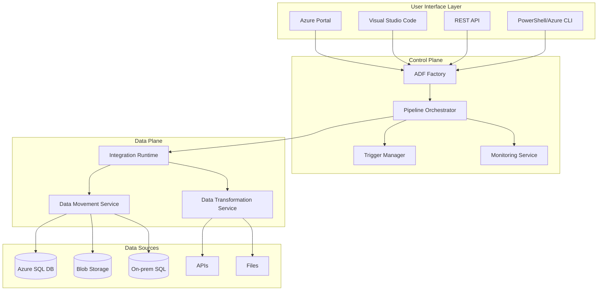

## ADF Architecture Flow

```
┌─────────────────────────────────────────────────────────────────┐
│                    Azure Data Factory                           │
├─────────────────────────────────────────────────────────────────┤
│  Source System → Linked Service → Dataset → Pipeline → Activity │
│                                                                 │
│  • SQL Server     • Connection     • Structure    • Workflow    │
│  • Oracle         • Auth Config    • Schema       • Activities  │
│  • SAP           • Credentials    • Metadata     • Scheduling  │
│  • REST API      • Endpoints      • Parameters   • Monitoring  │
│  • Blob Storage  • Keys           • Dynamic      • Triggers    │
│  • AWS S3        • Certificates   • Validation   • Alerts      │
└─────────────────────────────────────────────────────────────────┘
```

## Layers Breakdown

### Source Layer (Data Ingestion)
- **Relational Databases**: SQL Server, Oracle, MySQL, PostgreSQL
- **NoSQL Databases**: Cosmos DB, MongoDB, Cassandra
- **Cloud Storage**: Azure Blob, AWS S3, Google Cloud Storage
- **File Systems**: FTP, SFTP, HDFS
- **APIs**: REST, GraphQL, SOAP
- **Big Data**: HBase, Hive, Spark
- **ERP/CRM**: SAP, Salesforce, Dynamics 365

### Processing Layer (Data Transformation)
- **Copy Activity**: High-performance data movement
- **Data Flow**: Visual ETL transformations
- **Databricks**: Apache Spark processing
- **Stored Procedures**: SQL-based transformations
- **HDInsight**: Hadoop ecosystem processing
- **Azure Functions**: Serverless compute
- **Machine Learning**: Azure ML model scoring

### Destination Layer (Data Storage)
- **Data Warehouses**: Azure Synapse, Snowflake, Redshift
- **Data Lakes**: Azure Data Lake Storage, S3
- **Databases**: Azure SQL DB, SQL MI, PostgreSQL
- **Analytics**: Azure Analysis Services, Power BI
- **Search**: Azure Cognitive Search
- **Archive**: Azure Archive Storage

## Integration Runtime Types

### Azure Integration Runtime (AutoResolve)
- **Location**: Cloud-based, globally distributed
- **Use Case**: Cloud-to-cloud data movement
- **Scaling**: Auto-scales based on workload
- **Security**: Managed by Microsoft
- **Cost**: Pay-per-use, no infrastructure management

### Self-Hosted Integration Runtime (SHIR)
- **Location**: Customer-managed VMs or containers
- **Use Case**: Hybrid data integration, on-premises access
- **Connectivity**: Behind firewalls, private networks
- **Security**: Customer-controlled security
- **Cost**: VM/container costs + data movement fees

### Azure-SSIS Integration Runtime
- **Location**: Azure VMs running SSIS
- **Use Case**: Lift-and-shift SSIS packages
- **Compatibility**: Full SSIS feature support
- **Scaling**: Scale-out with multiple nodes
- **Cost**: VM costs + SSIS licensing

---

# 5. Azure Data Factory Components

## 5.1 Pipelines

A pipeline is a logical grouping of activities that together perform a task. Pipelines can be executed independently or chained together.

### Pipeline Characteristics
- **Modular Design**: Reusable across different scenarios
- **Parameterization**: Accept runtime parameters
- **Error Handling**: Built-in retry and failure handling
- **Monitoring**: Detailed execution logs and metrics
- **Scheduling**: Trigger-based or manual execution

### Example Pipeline Structure

```json
{
  "name": "PL_Load_Customer_Data",
  "properties": {
    "description": "Daily customer data loading pipeline",
    "activities": [
      {
        "name": "Extract_Customers",
        "type": "Copy",
        "description": "Copy customer data from source to staging"
      },
      {
        "name": "Validate_Data_Quality",
        "type": "SqlServerStoredProcedure",
        "description": "Execute data validation stored procedure"
      },
      {
        "name": "Load_Dim_Customers",
        "type": "Copy",
        "description": "Load validated data to dimension table"
      }
    ],
    "parameters": {
      "SourceSystem": {
        "type": "string",
        "defaultValue": "CRM"
      },
      "LoadDate": {
        "type": "string",
        "defaultValue": "@utcnow()"
      }
    }
  }
}
```

### Pipeline Execution Patterns

#### Sequential Execution
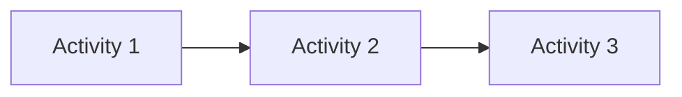

#### Parallel Execution
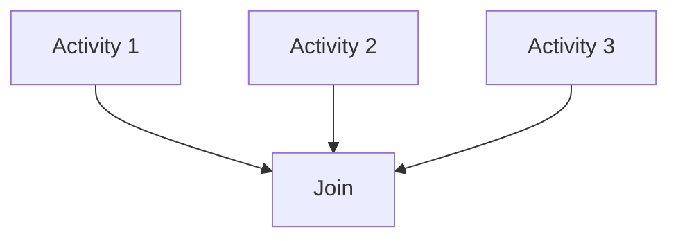

#### Conditional Execution
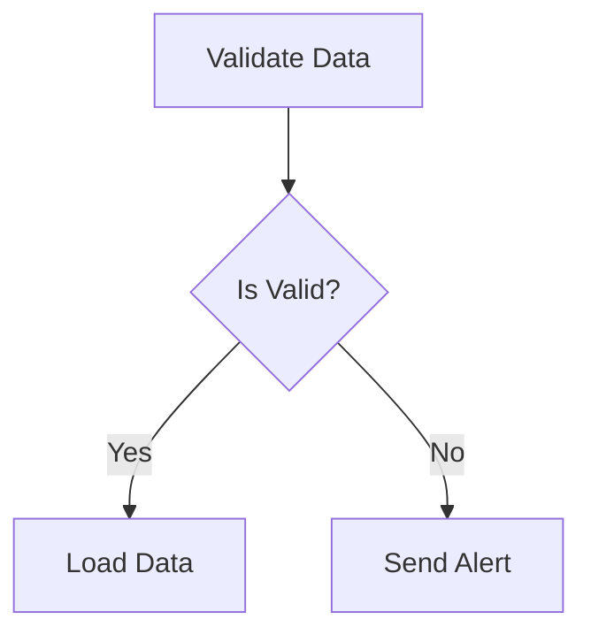

## 5.2 Activities

Activities are the processing steps within a pipeline. Each activity performs a specific operation on data.

### Types of Activities

| Activity Type | Purpose | Example Use Case |
|---------------|---------|------------------|
| **Copy Activity** | Move data between stores | Copy CSV files to Azure SQL DB |
| **Data Flow** | Visual data transformation | Cleanse and transform customer data |
| **Lookup** | Read small reference data | Get configuration parameters |
| **ForEach** | Iterate over collections | Process multiple files in a folder |
| **If Condition** | Conditional logic | Branch based on data validation results |
| **Execute Pipeline** | Call another pipeline | Modular pipeline design |
| **Stored Procedure** | Execute SQL procedures | Data validation or audit logging |
| **Web Activity** | Call REST APIs | Send notifications or trigger external processes |
| **Wait** | Add delays | Rate limiting or scheduling dependencies |
| **Fail** | Intentionally fail pipeline | Custom error handling scenarios |

### Activity Dependencies

Activities can be chained with dependency conditions:
- **Succeeded**: Execute only if previous activity succeeds
- **Failed**: Execute only if previous activity fails
- **Completed**: Execute regardless of previous activity status
- **Skipped**: Execute if previous activity is skipped

### Example: Complex Activity Flow

```json
{
  "name": "Process_Sales_Data",
  "type": "Copy",
  "dependsOn": [
    {
      "activity": "Validate_Source_Data",
      "dependencyConditions": ["Succeeded"]
    }
  ],
  "policy": {
    "timeout": "01:00:00",
    "retry": 3,
    "retryIntervalInSeconds": 30
  }
}
```

## 5.3 Datasets

Datasets represent the structure of data in linked data stores. They define the schema, location, and access patterns for data.

### Dataset Types

| Dataset Type | Description | Example |
|--------------|-------------|---------|
| **DelimitedText** | CSV, TSV files | `sales_data.csv` |
| **JSON** | JSON files/documents | `api_response.json` |
| **Parquet** | Columnar storage format | `analytics_data.parquet` |
| **SQL Table** | Database tables | `dbo.Customers` |
| **Binary** | Binary files | `images.zip` |
| **REST** | REST API endpoints | `https://api.example.com/data` |

### Dataset Parameters

Datasets support parameterization for dynamic behavior:

```json
{
  "name": "DS_Dynamic_SQL_Table",
  "properties": {
    "linkedServiceName": {
      "referenceName": "LS_SQL_Server",
      "type": "LinkedServiceReference"
    },
    "parameters": {
      "TableName": {
        "type": "string"
      },
      "SchemaName": {
        "type": "string",
        "defaultValue": "dbo"
      }
    },
    "type": "SqlServerTable",
    "typeProperties": {
      "tableName": {
        "value": "@concat(dataset().SchemaName, '.', dataset().TableName)",
        "type": "Expression"
      }
    }
  }
}
```

## 5.4 Linked Services

Linked services define the connection information to external data stores and compute services.

### Authentication Methods

| Method | Description | Use Case |
|--------|-------------|----------|
| **Connection String** | Embedded credentials | Development environments |
| **Key Vault** | Secure credential storage | Production environments |
| **Managed Identity** | Azure AD authentication | Secure, passwordless access |
| **Service Principal** | App registration auth | Automated deployments |
| **Basic Auth** | Username/password | Legacy system integration |
| **OAuth2** | Token-based auth | API integrations |

### Example: Azure SQL Database Linked Service

```json
{
  "name": "LS_Azure_SQL_DB",
  "properties": {
    "type": "AzureSqlDatabase",
    "typeProperties": {
      "connectionString": "Integrated Security=False;Encrypt=True;Connection Timeout=30;Data Source=myserver.database.windows.net;Initial Catalog=mydatabase",
      "password": {
        "type": "AzureKeyVaultSecret",
        "store": {
          "referenceName": "LS_KeyVault",
          "type": "LinkedServiceReference"
        },
        "secretName": "sql-password"
      },
      "userName": {
        "type": "AzureKeyVaultSecret",
        "store": {
          "referenceName": "LS_KeyVault",
          "type": "LinkedServiceReference"
        },
        "secretName": "sql-username"
      }
    }
  }
}
```

## 5.5 Triggers

Triggers define how and when pipelines should be executed.

### Trigger Types

| Trigger Type | Description | Example |
|--------------|-------------|---------|
| **Schedule** | Time-based execution | Daily at 6 AM |
| **Tumbling Window** | Process data in time windows | Hourly batches |
| **Event** | Event-driven execution | File arrival in Blob Storage |
| **Manual** | On-demand execution | User-initiated runs |

### Example: Schedule Trigger

```json
{
  "name": "TR_Daily_Load",
  "properties": {
    "type": "ScheduleTrigger",
    "typeProperties": {
      "recurrence": {
        "frequency": "Day",
        "interval": 1,
        "startTime": "2024-01-01T06:00:00Z",
        "timeZone": "UTC"
      }
    },
    "pipelines": [
      {
        "pipelineReference": {
          "referenceName": "PL_Daily_Data_Load",
          "type": "PipelineReference"
        },
        "parameters": {
          "LoadDate": "@trigger().scheduledTime"
        }
      }
    ]
  }
}
```

---

# 6. Azure Portal Basics

## Important Azure Services

| Service            | Purpose                 |
| ------------------ | ----------------------- |
| Resource Group     | Container for resources |
| Storage Account    | Store files/data        |
| Azure SQL Database | Database service        |
| Key Vault          | Secrets management      |
| Virtual Network    | Networking              |
| Monitor            | Logging and monitoring  |

---

# 7. Creating Azure Free Account

## Steps

1. Go to Azure official website
2. Create Microsoft account
3. Verify mobile number
4. Add card details
5. Activate free subscription

## Free Services

* Free credits
* Limited free storage
* Free databases
* Limited compute

---

# 8. Creating Azure Data Factory Instance

## Steps

1. Login to Azure Portal
2. Search for Azure Data Factory
3. Click Create
4. Select subscription
5. Select resource group
6. Enter factory name
7. Select region
8. Click Review + Create
9. Click Create

---

# 9. Understanding Integration Runtime

Integration Runtime (IR) is the compute infrastructure used by ADF.

## Types of IR

| Type           | Purpose                 |
| -------------- | ----------------------- |
| Azure IR       | Cloud data movement     |
| Self-Hosted IR | On-premise connectivity |
| Azure SSIS IR  | Execute SSIS packages   |

## Self-Hosted IR Usage

Used when:

* Data is inside local servers
* Firewall restrictions exist
* Private network access required

---

# 10. Linked Services

Linked service acts like a connection manager.

## Common Linked Services

* Azure Blob Storage
* Azure SQL Database
* SQL Server
* Oracle
* Snowflake
* REST API
* Amazon S3
* FTP/SFTP

## Steps to Create Linked Service

1. Open Manage Hub
2. Click Linked Services
3. Click New
4. Select connector
5. Enter credentials
6. Test connection
7. Create

---

# 11. Datasets

Dataset defines data structure.

## Dataset Examples

| Dataset Type   | Example                  |
| -------------- | ------------------------ |
| Delimited Text | CSV file                 |
| JSON           | API response             |
| Parquet        | Optimized analytics file |
| SQL Table      | Employee table           |

## Parameters in Dataset

Datasets can use dynamic values.

Example:

* Dynamic file names
* Dynamic table names
* Dynamic folder paths

---

# 12. Pipelines

Pipeline is the main orchestration component.

## Pipeline Features

* Sequential execution
* Parallel execution
* Conditional execution
* Dynamic execution
* Scheduling

## Real-Time Example

1. Read CSV file
2. Validate data
3. Load to staging table
4. Execute stored procedure
5. Send success email

---

# 13. Activities in ADF

## 13.1 Copy Activity

Used to move data.

### Supported Sources

* SQL
* Oracle
* Blob
* S3
* FTP
* APIs

### Supported Destinations

* Synapse
* SQL Database
* Data Lake
* Snowflake

## 13.2 Lookup Activity

Used to fetch small amounts of data.

## 13.3 Get Metadata Activity

Used to retrieve:

* File names
* File size
* Last modified date

## 13.4 Delete Activity

Deletes files/folders.

## 13.5 Validation Activity

Validates file existence.

---

# 14. Copy Data Activity

Copy Activity is the most fundamental and widely used activity in ADF, designed for high-performance data movement between various data stores.

## Working Flow

The copy activity follows a three-stage process:

```
┌─────────────┐    ┌─────────────┐    ┌─────────────┐
│   Source    │───▶│   Staging   │───▶│  Destination│
│   System    │    │   (Optional)│    │   System    │
└─────────────┘    └─────────────┘    └─────────────┘
```

### Stage 1: Read from Source
- Connect to source data store
- Apply source filters and partitioning
- Read data in parallel using multiple threads

### Stage 2: Staging (Optional)
- Temporary storage for data transformation
- Useful for cross-region data movement
- Enables data format conversion

### Stage 3: Write to Destination
- Connect to destination data store
- Apply data mapping and transformations
- Write data with error handling

## Supported Sources and Destinations

### Source Systems
- **Databases**: SQL Server, Oracle, MySQL, PostgreSQL, DB2
- **Data Warehouses**: Azure Synapse, Snowflake, Redshift
- **Cloud Storage**: Azure Blob, AWS S3, Google Cloud Storage
- **File Systems**: FTP, SFTP, HDFS
- **APIs**: REST, GraphQL endpoints
- **Big Data**: Hive, Spark, Cosmos DB

### Destination Systems
- **Databases**: Azure SQL DB, SQL MI, PostgreSQL
- **Data Warehouses**: Azure Synapse, Snowflake
- **Data Lakes**: Azure Data Lake Storage Gen2
- **Analytics**: Azure Analysis Services
- **Search**: Azure Cognitive Search

## Copy Activity Settings

### Source Configuration

```json
{
  "source": {
    "type": "DelimitedTextSource",
    "storeSettings": {
      "type": "AzureBlobStorageReadSettings",
      "recursive": true,
      "wildcardFolderPath": "data/year=*/month=*",
      "wildcardFileName": "*.csv"
    },
    "formatSettings": {
      "type": "DelimitedTextReadSettings",
      "skipLineCount": 1
    }
  }
}
```

### Sink Configuration

```json
{
  "sink": {
    "type": "SqlSink",
    "writeBehavior": "insert",
    "sqlWriterUseTableLock": false,
    "tableOption": "autoCreate",
    "storeSettings": {
      "type": "SqlServerStoreWriteSettings"
    }
  }
}
```

### Mapping Configuration

```json
{
  "mappings": [
    {
      "source": {
        "name": "customer_id",
        "type": "String"
      },
      "sink": {
        "name": "CustomerID",
        "type": "Int32"
      }
    },
    {
      "source": {
        "name": "full_name",
        "type": "String"
      },
      "sink": {
        "name": "CustomerName",
        "type": "String"
      }
    }
  ]
}
```

## Performance Optimization

### Parallel Copy Settings
- **Degree of Copy Parallelism**: Number of parallel threads (default: 1)
- **Data Integration Units (DIU)**: Compute power allocation (2-256)
- **Parallel Copies**: Maximum parallel copies per activity

### Partitioning Options
- **Physical Partitioning**: Split data by physical partitions
- **Dynamic Range Partitioning**: Split by column values
- **Hash Partitioning**: Distribute data evenly across partitions

### Example: Optimized Copy Activity

```json
{
  "name": "Copy_Large_Dataset",
  "type": "Copy",
  "typeProperties": {
    "source": {
      "type": "ParquetSource",
      "storeSettings": {
        "type": "AzureBlobStorageReadSettings",
        "enablePartitionDiscovery": true
      }
    },
    "sink": {
      "type": "SqlSink",
      "writeBehavior": "upsert",
      "upsertSettings": {
        "useTempDB": true,
        "keys": ["CustomerID"]
      }
    },
    "translator": {
      "type": "TabularTranslator",
      "mappings": [
        {
          "source": {"name": "customer_id"},
          "sink": {"name": "CustomerID"}
        }
      ]
    }
  },
  "policy": {
    "timeout": "02:00:00",
    "retry": 3,
    "retryIntervalInSeconds": 30
  }
}
```

## Fault Tolerance Features

### Error Handling
- **Fault Tolerance**: Skip incompatible rows
- **Redirect Incompatible Rows**: Store bad data separately
- **Logging Level**: Control error logging verbosity

### Retry Logic
- **Retry Count**: Number of retry attempts
- **Retry Interval**: Time between retries
- **Retryable Errors**: Network timeouts, temporary failures

## Copy Activity Best Practices

### Performance Tips
1. **Use Staging**: For cross-region transfers
2. **Enable Compression**: Reduce network bandwidth
3. **Optimize DIUs**: Scale compute based on data volume
4. **Use Partitioning**: Parallelize large dataset copies
5. **Monitor Throughput**: Track performance metrics

### Data Quality Tips
1. **Validate Schemas**: Ensure source/destination compatibility
2. **Handle Data Types**: Proper type mapping and conversion
3. **Manage Null Values**: Define null handling strategies
4. **Set Row Limits**: Prevent runaway processing

### Example: Complete Copy Pipeline

```json
{
  "name": "PL_Copy_With_Error_Handling",
  "properties": {
    "activities": [
      {
        "name": "Copy_Sales_Data",
        "type": "Copy",
        "inputs": [
          {"referenceName": "DS_Sales_CSV", "type": "DatasetReference"}
        ],
        "outputs": [
          {"referenceName": "DS_Sales_SQL", "type": "DatasetReference"}
        ],
        "typeProperties": {
          "source": {
            "type": "DelimitedTextSource",
            "storeSettings": {
              "type": "AzureBlobStorageReadSettings"
            },
            "formatSettings": {
              "type": "DelimitedTextReadSettings",
              "skipLineCount": 1
            }
          },
          "sink": {
            "type": "SqlSink",
            "writeBehavior": "insert",
            "sqlWriterStoredProcedureName": "usp_InsertSalesData",
            "sqlWriterTableType": "SalesDataType",
            "storeSettings": {
              "type": "SqlServerStoreWriteSettings"
            }
          },
          "enableStaging": false,
          "translator": {
            "type": "TabularTranslator",
            "mappings": [
              {
                "source": {"name": "OrderID", "type": "String"},
                "sink": {"name": "OrderID", "type": "Int32"}
              },
              {
                "source": {"name": "OrderDate", "type": "String"},
                "sink": {"name": "OrderDate", "type": "DateTime"}
              }
            ]
          }
        },
        "policy": {
          "timeout": "01:00:00",
          "retry": 3,
          "retryIntervalInSeconds": 30
        }
      }
    ]
  }
}
```

---

# 15. Data Flow

Data Flow is ADF's visual data transformation engine that enables code-free ETL/ELT operations using a drag-and-drop interface.

## Types of Data Flows

### Mapping Data Flow
- **Purpose**: Visual ETL transformations
- **Execution**: Spark-based processing
- **Use Case**: Complex data transformations
- **Target**: Data warehouses, data lakes

### Wrangling Data Flow
- **Purpose**: Power Query-style transformations
- **Execution**: Spark-based processing
- **Use Case**: Data preparation and cleansing
- **Target**: Self-service data prep

## Data Flow Architecture

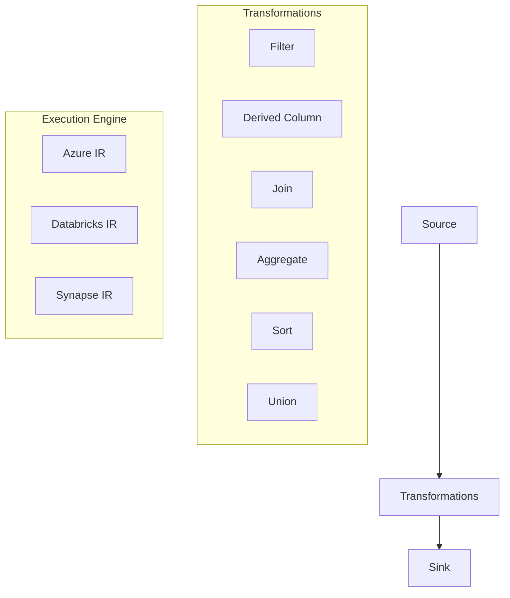

## Common Transformations

### Data Cleansing Transformations

| Transformation | Purpose | Example |
|----------------|---------|---------|
| **Filter** | Remove unwanted rows | `WHERE status != 'inactive'` |
| **Derived Column** | Create calculated columns | `FullName = concat(FirstName, ' ', LastName)` |
| **Select** | Choose specific columns | Keep only relevant fields |
| **Sort** | Order data | Sort by date descending |
| **Distinct** | Remove duplicates | Unique customer records |

### Data Integration Transformations

| Transformation | Purpose | Example |
|----------------|---------|---------|
| **Join** | Combine datasets | Customer + Orders = Sales data |
| **Union** | Stack datasets | Combine monthly sales files |
| **Lookup** | Enrich with reference data | Add product categories |
| **Exists** | Check for matches | Validate against master data |
| **Conditional Split** | Route data conditionally | Valid vs invalid records |

### Data Aggregation Transformations

| Transformation | Purpose | Example |
|----------------|---------|---------|
| **Aggregate** | Group and summarize | Sales by region and month |
| **Window** | Rolling calculations | Moving averages, rankings |
| **Pivot** | Crosstab data | Months as columns |
| **Unpivot** | Normalize data | Columns to rows |

## Data Flow Execution Modes

### Debug Mode
- **Purpose**: Test and validate transformations
- **Data Sampling**: Process subset of data
- **Interactive**: Real-time preview of results
- **Cost**: Minimal compute usage

### Pipeline Execution
- **Purpose**: Production data processing
- **Full Dataset**: Process all data
- **Performance**: Optimized for large volumes
- **Integration**: Part of pipeline workflows

## Example: Complete Data Flow

```json
{
  "name": "DF_Transform_Sales_Data",
  "properties": {
    "type": "MappingDataFlow",
    "typeProperties": {
      "sources": [
        {
          "name": "SalesSource",
          "dataset": {
            "referenceName": "DS_Sales_CSV",
            "type": "DatasetReference"
          }
        }
      ],
      "sinks": [
        {
          "name": "SalesSink",
          "dataset": {
            "referenceName": "DS_Sales_Parquet",
            "type": "DatasetReference"
          }
        }
      ],
      "transformations": [
        {
          "name": "FilterValidRecords",
          "type": "Filter",
          "typeProperties": {
            "condition": "status == 'active' && amount > 0"
          }
        },
        {
          "name": "AddCalculatedColumns",
          "type": "DerivedColumn",
          "typeProperties": {
            "columns": [
              {
                "name": "TotalAmount",
                "expression": "amount * quantity"
              },
              {
                "name": "OrderDateFormatted",
                "expression": "toDate(order_date, 'yyyy-MM-dd')"
              }
            ]
          }
        },
        {
          "name": "JoinWithCustomers",
          "type": "Join",
          "typeProperties": {
            "left": "FilterValidRecords",
            "right": "CustomerLookup",
            "joinType": "inner",
            "leftKeys": ["customer_id"],
            "rightKeys": ["id"]
          }
        }
      ],
      "script": "source(output(..."
    }
  }
}
```

## Data Flow Performance Optimization

### Cluster Configuration
- **Compute Type**: General Purpose vs Memory Optimized
- **Core Count**: Number of Spark cores
- **Time to Live**: Cluster idle timeout

### Partitioning Strategy
- **Current Partitioning**: Maintain existing partitions
- **Hash Partitioning**: Distribute evenly across partitions
- **Key Partitioning**: Partition by specific columns
- **Round Robin**: Random distribution

### Caching Strategy
- **Output Caching**: Cache transformation results
- **Input Caching**: Cache source data
- **Memory Management**: Optimize for large datasets

## Data Flow Best Practices

### Development Best Practices
1. **Modular Design**: Break complex flows into smaller flows
2. **Naming Conventions**: Use descriptive transformation names
3. **Data Preview**: Regularly preview data at each step
4. **Error Handling**: Implement proper error handling patterns

### Performance Best Practices
1. **Optimize Sources**: Use appropriate source partitioning
2. **Minimize Shuffles**: Reduce data movement between partitions
3. **Use Caching**: Cache intermediate results when beneficial
4. **Monitor Metrics**: Track transformation performance

### Example: Optimized Data Flow Pattern

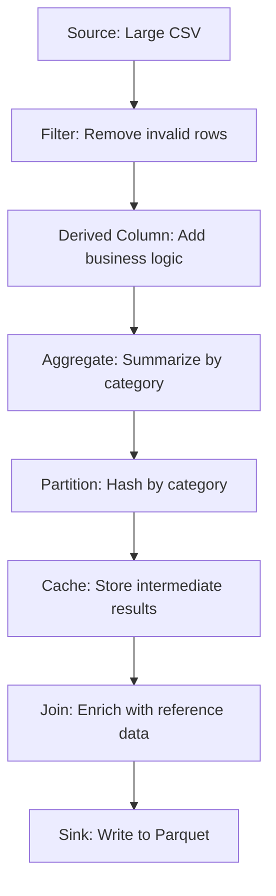

## Integration with Other Services

### Synapse Integration
- **Serverless SQL Pools**: Query data flow outputs
- **Dedicated SQL Pools**: Load transformed data
- **Spark Pools**: Execute complex transformations

### Databricks Integration
- **Delta Lake**: ACID transactions on data lakes
- **MLflow**: Model training and deployment
- **Structured Streaming**: Real-time data processing

### Power BI Integration
- **Direct Query**: Query data flow outputs
- **Import Mode**: Scheduled data refreshes
- **Composite Models**: Combine multiple data sources

---

# 16. Control Flow Activities

## Important Control Activities

| Activity     | Purpose                     |
| ------------ | --------------------------- |
| If Condition | Conditional logic           |
| Switch       | Multiple conditions         |
| Until        | Loop until condition met    |
| ForEach      | Iterate collections         |
| Wait         | Delay execution             |
| Fail         | Fail pipeline intentionally |

---

# 17. Parameters and Variables

Parameters and variables enable dynamic behavior in ADF pipelines, allowing for reusable and configurable data workflows.

## Parameters

Parameters are external values passed to pipelines at runtime. They enable pipeline reusability across different environments and scenarios.

### Parameter Types

| Type | Description | Example |
|------|-------------|---------|
| **String** | Text values | `"prod"`, `"@pipeline().Pipeline"` |
| **Int** | Integer numbers | `100`, `0` |
| **Float** | Decimal numbers | `1.5`, `99.99` |
| **Bool** | True/false values | `true`, `false` |
| **Array** | List of values | `["item1", "item2"]` |
| **Object** | Key-value pairs | `{"key": "value"}` |

### Parameter Usage Examples

#### Pipeline Parameters

```json
{
  "name": "PL_Load_Data",
  "properties": {
    "parameters": {
      "SourceContainer": {
        "type": "string",
        "defaultValue": "raw-data"
      },
      "TargetTable": {
        "type": "string",
        "defaultValue": "staging.Sales"
      },
      "LoadDate": {
        "type": "string",
        "defaultValue": "@utcnow()"
      },
      "IsIncremental": {
        "type": "bool",
        "defaultValue": false
      }
    }
  }
}
```

#### Dataset Parameters

```json
{
  "name": "DS_Dynamic_SQL_Table",
  "properties": {
    "parameters": {
      "SchemaName": {
        "type": "string",
        "defaultValue": "dbo"
      },
      "TableName": {
        "type": "string"
      }
    },
    "type": "SqlServerTable",
    "typeProperties": {
      "tableName": {
        "value": "@concat(dataset().SchemaName, '.', dataset().TableName)",
        "type": "Expression"
      }
    }
  }
}
```

#### Linked Service Parameters

```json
{
  "name": "LS_Parameterised_SQL",
  "properties": {
    "parameters": {
      "ServerName": {
        "type": "string"
      },
      "DatabaseName": {
        "type": "string"
      }
    },
    "type": "SqlServer",
    "typeProperties": {
      "connectionString": "Integrated Security=False;Encrypt=True;Connection Timeout=30;Data Source=@{linkedService().ServerName};Initial Catalog=@{linkedService().DatabaseName}"
    }
  }
}
```

## Variables

Variables are internal pipeline values that can be set and modified during pipeline execution. They are useful for storing intermediate results or configuration values.

### Variable Types

| Type | Description | Example |
|------|-------------|---------|
| **String** | Text values | `"processing"` |
| **Boolean** | True/false | `true` |
| **Array** | List of items | `["file1.csv", "file2.csv"]` |
| **Object** | Complex objects | `{"status": "success"}` |

### Variable Scope

- **Pipeline Scope**: Available throughout the pipeline
- **Activity Scope**: Limited to specific activities (Set Variable activity)

### Variable Activities

#### Set Variable Activity

```json
{
  "name": "Set_Processing_Status",
  "type": "SetVariable",
  "typeProperties": {
    "variableName": "ProcessingStatus",
    "value": "InProgress"
  }
}
```

#### Append Variable Activity

```json
{
  "name": "Append_File_List",
  "type": "AppendVariable",
  "typeProperties": {
    "variableName": "ProcessedFiles",
    "value": "@item().name"
  }
}
```

## Expressions and Dynamic Content

ADF uses expressions to create dynamic values using functions, operators, and references.

### Expression Syntax

```
@{<expression>}
```

### Common Expression Functions

#### String Functions

| Function | Description | Example |
|----------|-------------|---------|
| `concat()` | Join strings | `concat('Table_', pipeline().parameters.TableSuffix)` |
| `substring()` | Extract substring | `substring('HelloWorld', 0, 5)` → `"Hello"` |
| `replace()` | Replace text | `replace('Hello World', 'World', 'ADF')` |
| `split()` | Split string | `split('a,b,c', ',')` → `['a','b','c']` |
| `toLower()` | Convert to lowercase | `toLower('HELLO')` → `"hello"` |
| `toUpper()` | Convert to uppercase | `toUpper('hello')` → `"HELLO"` |

#### Date/Time Functions

| Function | Description | Example |
|----------|-------------|---------|
| `utcnow()` | Current UTC time | `2024-01-15T10:30:00Z` |
| `adddays()` | Add days to date | `adddays(utcnow(), -1)` |
| `formatDateTime()` | Format date | `formatDateTime(utcnow(), 'yyyy-MM-dd')` |
| `startOfDay()` | Start of day | `startOfDay(utcnow())` |
| `dayOfWeek()` | Day of week | `dayOfWeek(utcnow())` |

#### Mathematical Functions

| Function | Description | Example |
|----------|-------------|---------|
| `add()` | Addition | `add(10, 5)` → `15` |
| `sub()` | Subtraction | `sub(10, 5)` → `5` |
| `mul()` | Multiplication | `mul(10, 5)` → `50` |
| `div()` | Division | `div(10, 5)` → `2` |
| `mod()` | Modulo | `mod(10, 3)` → `1` |

#### Collection Functions

| Function | Description | Example |
|----------|-------------|---------|
| `length()` | Array length | `length(['a','b','c'])` → `3` |
| `contains()` | Check membership | `contains(['a','b','c'], 'b')` → `true` |
| `union()` | Combine arrays | `union(['a','b'], ['c','d'])` → `['a','b','c','d']` |
| `intersection()` | Common elements | `intersection(['a','b'], ['b','c'])` → `['b']` |
| `first()` | First element | `first(['a','b','c'])` → `"a"` |
| `last()` | Last element | `last(['a','b','c'])` → `"c"` |

#### Logical Functions

| Function | Description | Example |
|----------|-------------|---------|
| `if()` | Conditional logic | `if(equals(1, 1), 'Equal', 'Not Equal')` |
| `equals()` | Equality check | `equals('a', 'a')` → `true` |
| `and()` | Logical AND | `and(true, false)` → `false` |
| `or()` | Logical OR | `or(true, false)` → `true` |
| `not()` | Logical NOT | `not(true)` → `false` |

### Context References

| Reference | Description | Example |
|-----------|-------------|---------|
| `pipeline()` | Pipeline metadata | `pipeline().Pipeline` |
| `pipeline().parameters` | Pipeline parameters | `pipeline().parameters.SourceTable` |
| `pipeline().globalParameters` | Global parameters | `pipeline().globalParameters.Environment` |
| `variables()` | Pipeline variables | `variables('Counter')` |
| `activity()` | Activity output | `activity('LookupConfig').output` |
| `item()` | ForEach item | `item().name` |
| `trigger()` | Trigger metadata | `trigger().scheduledTime` |

### Advanced Expression Examples

#### Dynamic File Paths

```json
{
  "folderPath": "@concat('data/', formatDateTime(utcnow(), 'yyyy'), '/', formatDateTime(utcnow(), 'MM'), '/')"
}
```

#### Conditional Logic

```json
{
  "tableName": "@if(equals(pipeline().parameters.Environment, 'prod'), 'dbo.Prod_Sales', 'dbo.Dev_Sales')"
}
```

#### Array Processing

```json
{
  "fileList": "@split(activity('Get_File_List').output.value, ',')"
}
```

#### Date Calculations

```json
{
  "startDate": "@formatDateTime(adddays(utcnow(), -30), 'yyyy-MM-dd')",
  "endDate": "@formatDateTime(utcnow(), 'yyyy-MM-dd')"
}
```

## Best Practices for Parameters and Variables

### Parameter Best Practices
1. **Use Descriptive Names**: `SourceContainer` vs `param1`
2. **Provide Default Values**: Enable testing without all parameters
3. **Validate Input**: Use appropriate data types
4. **Document Usage**: Comment complex expressions

### Variable Best Practices
1. **Initialize Early**: Set variables at pipeline start
2. **Use Appropriate Scope**: Pipeline vs activity level
3. **Avoid Overuse**: Don't replace parameters with variables
4. **Monitor Values**: Log variable values for debugging

### Expression Best Practices
1. **Test Expressions**: Use debug mode to validate
2. **Handle Nulls**: Use `coalesce()` for null handling
3. **Performance**: Cache expensive expressions in variables
4. **Readability**: Break complex expressions into steps

---

# 18. Expressions and Dynamic Content

ADF uses dynamic expressions.

## Common Functions

| Function    | Purpose           |
| ----------- | ----------------- |
| concat()    | Combine strings   |
| utcNow()    | Current UTC time  |
| pipeline()  | Pipeline metadata |
| variables() | Access variable   |
| activity()  | Activity output   |
| substring() | Extract text      |

## Example

```text
@concat('File_',utcNow(),'.csv')
```

---

# 19. Triggers

Triggers automate execution.

## 19.1 Schedule Trigger

Runs pipeline at fixed intervals.

Example:

* Daily at 9 PM
* Every hour

## 19.2 Tumbling Window Trigger

Processes data in chunks/windows.

Used in incremental loading.

## 19.3 Event Trigger

Executes when:

* File arrives
* Blob created
* Blob deleted

---

# 20. Monitoring and Debugging

## Monitoring Options

* Pipeline runs
* Activity runs
* Trigger runs
* Error logs

## Debug Mode

Used for testing pipelines.

## Monitoring Metrics

* Duration
* Throughput
* Queue time
* Rows copied

---

# 21. Error Handling

## Common Techniques

### Try-Catch Pattern

Use:

* Execute pipeline
* Failure path
* Success path

### Logging Errors

Store errors into:

* SQL table
* Blob storage
* Log analytics

## Retry Mechanism

ADF supports retries.

Example:

* Retry count = 3
* Retry interval = 30 sec

---

# 22. Incremental Load

Incremental load copies only new or changed data.

## Advantages

* Faster execution
* Lower cost
* Reduced load on systems

## Common Approaches

| Method          | Description         |
| --------------- | ------------------- |
| Watermark       | Based on date/time  |
| CDC             | Change Data Capture |
| Timestamp       | Last modified value |
| Identity Column | Max ID tracking     |

## Incremental Load Flow

1. Get max timestamp
2. Fetch new data
3. Load into target
4. Update watermark table

---

# 23. Full Load

Full load copies complete data every time.

## Advantages

* Simpler logic
* Easy implementation

## Disadvantages

* Higher execution time
* Higher cost
* Duplicate risk

---

# 24. ETL vs ELT in ADF

| Feature        | ETL            | ELT           |
| -------------- | -------------- | ------------- |
| Transformation | Before loading | After loading |
| Performance    | Slower         | Faster        |
| Compute        | External       | Target system |
| Example        | SSIS           | Synapse       |

## ETL Flow

Extract → Transform → Load

## ELT Flow

Extract → Load → Transform

---

# 25. Connecting Different Data Sources

## Supported Sources

* SQL Server
* Oracle
* MySQL
* PostgreSQL
* SAP
* Blob Storage
* S3
* Google Cloud Storage
* REST APIs
* Salesforce
* ServiceNow

---

# 26. SQL Integration with ADF

## Common SQL Operations

* Execute stored procedures
* Read SQL tables
* Insert/update data
* Merge operations

## Stored Procedure Activity

Used to execute SQL procedures.

## Example Use Cases

* Audit logging
* Data validation
* Merge operations
* Data cleansing

---

# 27. File Handling in ADF

## Supported File Formats

| Format  | Usage           |
| ------- | --------------- |
| CSV     | Flat file       |
| JSON    | Semi-structured |
| XML     | Hierarchical    |
| Parquet | Analytics       |
| Avro    | Big data        |
| Excel   | Reporting       |

## Compression Support

* ZIP
* GZIP
* BZIP2

---

# 28. REST API Integration

ADF can connect to APIs.

## Steps

1. Create REST linked service
2. Configure authentication
3. Create dataset
4. Use copy activity

## Authentication Types

* Anonymous
* Basic
* OAuth2
* Managed Identity

---

# 29. Scheduling Pipelines

## Scheduling Methods

| Method  | Example          |
| ------- | ---------------- |
| Hourly  | Every 1 hour     |
| Daily   | Daily at 10 PM   |
| Weekly  | Every Sunday     |
| Monthly | 1st day of month |

---

# 30. CI/CD in ADF

CI/CD means Continuous Integration and Continuous Deployment.

## Benefits

* Automated deployment
* Version control
* Faster release cycles
* Reduced manual effort

## Tools Used

* Azure DevOps
* GitHub
* ARM Templates

---

# 31. Git Integration

ADF supports Git integration.

## Supported Repositories

* Azure DevOps Git
* GitHub

## Benefits

* Version control
* Collaboration
* Rollback support
* Branching

---

# 32. ARM Templates

ARM templates are used for deployment automation.

## Uses

* Infrastructure deployment
* Environment migration
* Backup configuration

---

# 33. Security in ADF

## Security Features

* Encryption
* RBAC
* Managed Identity
* Private endpoints
* Key Vault integration

---

# 34. Managed Identity

Managed identity removes need for storing passwords.

## Benefits

* Secure authentication
* Passwordless access
* Easy integration

---

# 35. Role-Based Access Control (RBAC)

RBAC controls user permissions.

## Common Roles

| Role                     | Access           |
| ------------------------ | ---------------- |
| Owner                    | Full access      |
| Contributor              | Modify resources |
| Reader                   | Read-only        |
| Data Factory Contributor | ADF access       |

---

# 36. Azure Key Vault Integration

Key Vault stores secrets securely.

## Stored Items

* Passwords
* API keys
* Connection strings
* Certificates

## Advantages

* Improved security
* Centralized secrets management

---

# 37. Performance Optimization

## Optimization Techniques

* Parallel copy
* Partitioning
* Compression
* Incremental loading
* Proper IR selection
* Optimize data flow clusters

## Performance Metrics

* DIU usage
* Throughput
* Queue duration

---

# 38. Logging and Monitoring

## Monitoring Tools

* Azure Monitor
* Log Analytics
* Diagnostic logs
* Alerts

## Alert Examples

* Pipeline failure
* High execution time
* Integration runtime offline

---

# 39. Data Lake Integration

ADF integrates with Azure Data Lake.

## Advantages

* Scalable storage
* Cheap storage
* Big data processing

## Common Architecture

Source → ADF → Data Lake → Synapse/Databricks

---

# 40. Synapse Integration

ADF works closely with Azure Synapse.

## Use Cases

* Data warehouse loading
* ELT processing
* Analytics pipelines

---

# 41. Databricks Integration

ADF can execute Databricks notebooks.

## Common Use Cases

* PySpark processing
* Machine learning
* Big data transformation

---

# 42. Snowflake Integration

ADF supports Snowflake connectivity.

## Operations

* Data loading
* Data extraction
* Stored procedure execution

---

# 43. SAP Integration

ADF supports SAP connectors.

## SAP Connectors

* SAP Table
* SAP ECC
* SAP HANA
* SAP BW

---

# 44. Real-Time Scenarios

## Banking Scenario

* Extract transactions
* Validate records
* Load to warehouse
* Generate reports

## E-Commerce Scenario

* API ingestion
* Customer analytics
* Sales reporting

## Healthcare Scenario

* Patient records integration
* Daily ETL processing

---

# 45. End-to-End Projects

## Project 1: CSV to SQL Database Pipeline

### Business Scenario
A retail company receives daily sales data in CSV format from multiple stores. The data needs to be validated, transformed, and loaded into a central SQL database for reporting.

### Architecture Diagram

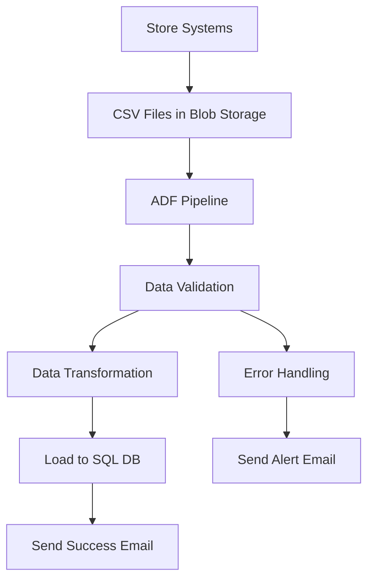

### Pipeline Components

#### 1. Linked Services
```json
{
  "LS_Blob_Storage": {
    "type": "AzureBlobStorage",
    "typeProperties": {
      "connectionString": "@linkedService().StorageConnectionString"
    }
  },
  "LS_SQL_Database": {
    "type": "AzureSqlDatabase",
    "typeProperties": {
      "connectionString": "@linkedService().SqlConnectionString"
    }
  }
}
```

#### 2. Datasets
```json
{
  "DS_Sales_CSV": {
    "type": "DelimitedText",
    "linkedServiceName": {"referenceName": "LS_Blob_Storage"},
    "typeProperties": {
      "location": {
        "type": "AzureBlobStorageLocation",
        "fileName": "*.csv",
        "folderPath": "sales-data"
      },
      "columnDelimiter": ",",
      "firstRowAsHeader": true
    }
  },
  "DS_Sales_SQL": {
    "type": "AzureSqlTable",
    "linkedServiceName": {"referenceName": "LS_SQL_Database"},
    "typeProperties": {
      "tableName": "dbo.Sales"
    }
  }
}
```

#### 3. Pipeline Activities
```json
{
  "name": "PL_Load_Sales_Data",
  "properties": {
    "activities": [
      {
        "name": "Validate_File_Existence",
        "type": "GetMetadata",
        "typeProperties": {
          "dataset": {"referenceName": "DS_Sales_CSV"},
          "fieldList": ["exists", "itemName", "lastModified"]
        }
      },
      {
        "name": "Copy_Sales_Data",
        "type": "Copy",
        "dependsOn": [
          {
            "activity": "Validate_File_Existence",
            "dependencyConditions": ["Succeeded"]
          }
        ],
        "typeProperties": {
          "source": {
            "type": "DelimitedTextSource",
            "storeSettings": {"type": "AzureBlobStorageReadSettings"}
          },
          "sink": {
            "type": "SqlSink",
            "writeBehavior": "insert",
            "tableOption": "autoCreate"
          },
          "translator": {
            "type": "TabularTranslator",
            "mappings": [
              {"source": {"name": "store_id"}, "sink": {"name": "StoreID"}},
              {"source": {"name": "product_id"}, "sink": {"name": "ProductID"}},
              {"source": {"name": "sales_amount"}, "sink": {"name": "SalesAmount"}},
              {"source": {"name": "sales_date"}, "sink": {"name": "SalesDate"}}
            ]
          }
        }
      },
      {
        "name": "Execute_Data_Quality_Check",
        "type": "SqlServerStoredProcedure",
        "dependsOn": [
          {
            "activity": "Copy_Sales_Data",
            "dependencyConditions": ["Succeeded"]
          }
        ],
        "typeProperties": {
          "storedProcedureName": "usp_ValidateSalesData"
        }
      },
      {
        "name": "Send_Success_Notification",
        "type": "WebActivity",
        "dependsOn": [
          {
            "activity": "Execute_Data_Quality_Check",
            "dependencyConditions": ["Succeeded"]
          }
        ],
        "typeProperties": {
          "method": "POST",
          "url": "https://api.sendgrid.com/v3/mail/send",
          "headers": {
            "Authorization": "@linkedService().SendGridApiKey",
            "Content-Type": "application/json"
          },
          "body": {
            "personalizations": [
              {
                "to": [{"email": "data-team@company.com"}],
                "subject": "Sales Data Load Completed Successfully"
              }
            ],
            "from": {"email": "adf@company.com"},
            "content": [
              {
                "type": "text/plain",
                "value": "Sales data has been successfully loaded and validated."
              }
            ]
          }
        }
      }
    ]
  }
}
```

#### 4. Error Handling
```json
{
  "name": "Send_Failure_Notification",
  "type": "WebActivity",
  "dependsOn": [
    {
      "activity": "Copy_Sales_Data",
      "dependencyConditions": ["Failed"]
    }
  ],
  "typeProperties": {
    "method": "POST",
    "url": "https://hooks.slack.com/services/...",
    "body": {
      "text": "ALERT: Sales data load failed. Please check ADF monitoring."
    }
  }
}
```

## Project 2: Incremental Data Load with Watermarking

### Business Scenario
A healthcare provider needs to incrementally load patient records from an on-premises SQL Server to Azure Synapse Analytics, processing only new or changed records since the last load.

### Solution Architecture

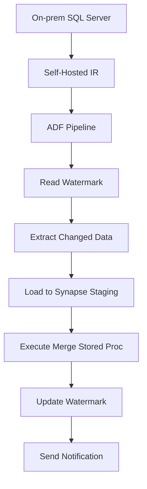

### Implementation Steps

#### 1. Watermark Table Creation
```sql
CREATE TABLE dbo.WatermarkTable (
    TableName VARCHAR(100) PRIMARY KEY,
    LastLoadDate DATETIME2
);

INSERT INTO dbo.WatermarkTable VALUES
('Patients', '2024-01-01 00:00:00');
```

#### 2. Pipeline Parameters
```json
{
  "parameters": {
    "SourceTable": {"type": "string", "defaultValue": "Patients"},
    "WatermarkColumn": {"type": "string", "defaultValue": "LastModifiedDate"},
    "BatchSize": {"type": "int", "defaultValue": 10000}
  }
}
```

#### 3. Lookup Watermark Activity
```json
{
  "name": "Lookup_Last_Watermark",
  "type": "Lookup",
  "typeProperties": {
    "source": {
      "type": "SqlServerSource",
      "sqlReaderQuery": "SELECT LastLoadDate FROM dbo.WatermarkTable WHERE TableName = '@{pipeline().parameters.SourceTable}'"
    },
    "dataset": {"referenceName": "DS_Watermark_SQL"}
  }
}
```

#### 4. Copy Changed Data Activity
```json
{
  "name": "Copy_Incremental_Data",
  "type": "Copy",
  "typeProperties": {
    "source": {
      "type": "SqlServerSource",
      "sqlReaderQuery": "@concat('SELECT * FROM ', pipeline().parameters.SourceTable, ' WHERE ', pipeline().parameters.WatermarkColumn, ' > ''', activity('Lookup_Last_Watermark').output.firstRow.LastLoadDate, ''' ORDER BY ', pipeline().parameters.WatermarkColumn)"
    },
    "sink": {
      "type": "SqlDWSink",
      "writeBehavior": "insert",
      "preCopyScript": "TRUNCATE TABLE Staging.Patients"
    }
  }
}
```

#### 5. Update Watermark Activity
```json
{
  "name": "Update_Watermark",
  "type": "SqlServerStoredProcedure",
  "typeProperties": {
    "storedProcedureName": "usp_UpdateWatermark",
    "storedProcedureParameters": {
      "TableName": {"value": "@pipeline().parameters.SourceTable", "type": "String"},
      "NewWatermark": {"value": "@utcnow()", "type": "DateTime"}
    }
  }
}
```

## Project 3: Real-Time API Data Ingestion

### Business Scenario
An e-commerce platform needs to ingest real-time order data from a REST API, transform it, and load it into both a data lake for analytics and a SQL database for operational reporting.

### Architecture Overview

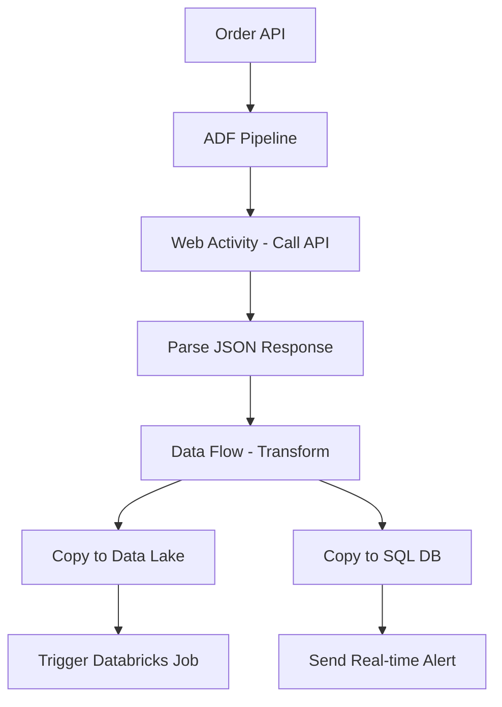

### Implementation Details

#### 1. REST API Linked Service
```json
{
  "name": "LS_Order_API",
  "type": "RestService",
  "typeProperties": {
    "url": "https://api.ecommerce.com/orders",
    "authenticationType": "Basic",
    "userName": "@linkedService().ApiUsername",
    "password": "@linkedService().ApiPassword"
  }
}
```

#### 2. Web Activity for API Call
```json
{
  "name": "Call_Order_API",
  "type": "WebActivity",
  "typeProperties": {
    "method": "GET",
    "url": "https://api.ecommerce.com/orders",
    "headers": {
      "Authorization": "@concat('Bearer ', linkedService().ApiToken)",
      "Content-Type": "application/json"
    },
    "body": {
      "startDate": "@formatDateTime(addhours(utcnow(), -1), 'yyyy-MM-ddTHH:mm:ssZ')",
      "endDate": "@formatDateTime(utcnow(), 'yyyy-MM-ddTHH:mm:ssZ')"
    }
  }
}
```

#### 3. Data Flow for Transformation
```json
{
  "name": "DF_Transform_Order_Data",
  "type": "MappingDataFlow",
  "typeProperties": {
    "sources": [
      {
        "name": "OrderSource",
        "dataset": {"referenceName": "DS_Order_JSON"}
      }
    ],
    "transformations": [
      {
        "name": "Flatten_Order_Items",
        "type": "Flatten",
        "typeProperties": {
          "unrollBy": "orderItems",
          "unrollRoot": "orders"
        }
      },
      {
        "name": "Add_Calculated_Fields",
        "type": "DerivedColumn",
        "typeProperties": {
          "columns": [
            {
              "name": "OrderTotal",
              "expression": "orderItems.price * orderItems.quantity"
            },
            {
              "name": "ProcessingTimestamp",
              "expression": "currentTimestamp()"
            }
          ]
        }
      }
    ],
    "sinks": [
      {
        "name": "DataLakeSink",
        "dataset": {"referenceName": "DS_Order_Parquet"}
      },
      {
        "name": "SqlSink",
        "dataset": {"referenceName": "DS_Order_SQL"}
      }
    ]
  }
}
```

## Project 4: Multi-Source Data Consolidation

### Business Scenario
A financial institution needs to consolidate customer data from multiple sources (CRM, ERP, Transaction Systems) into a unified customer view in Azure Synapse.

### Solution Approach

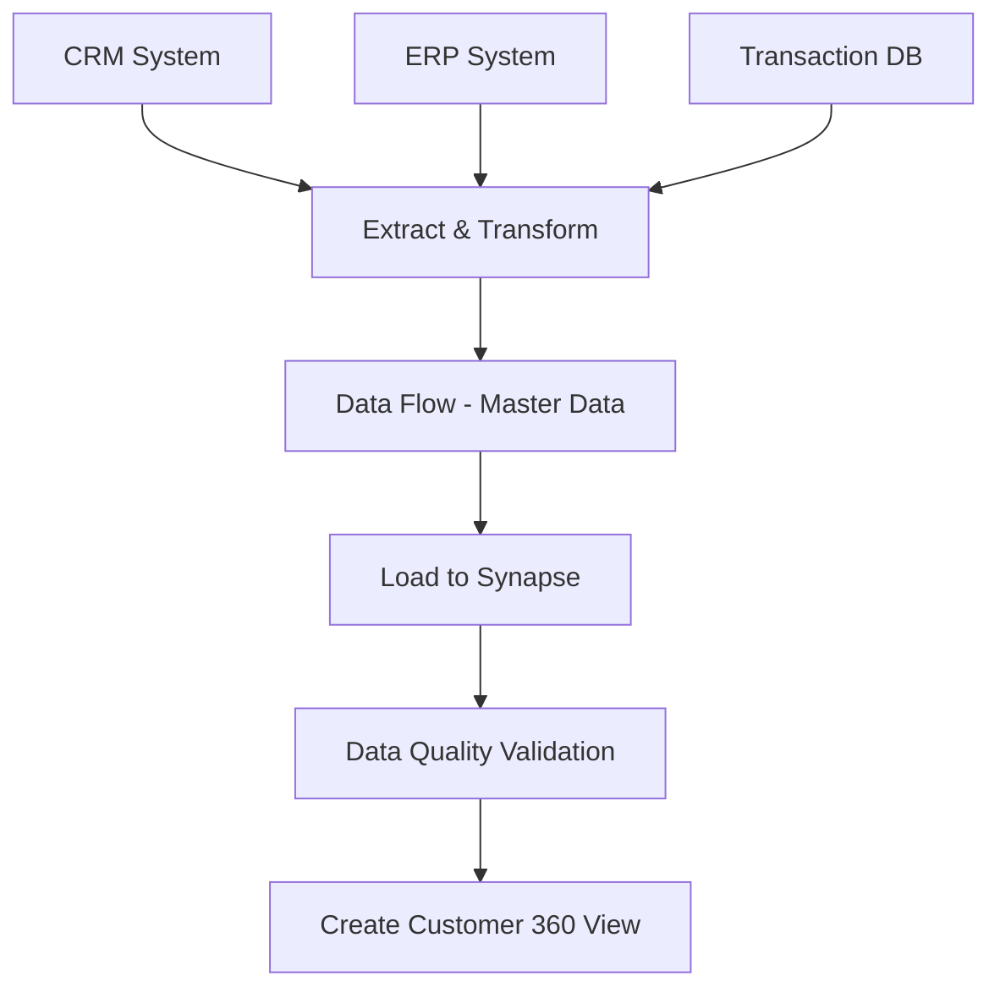

### Key Implementation Aspects

#### 1. Multiple Source Handling
- Different data formats (JSON, XML, CSV)
- Various connection types (API, Database, Files)
- Incremental vs full load strategies

#### 2. Data Quality Framework
- Duplicate detection and merging
- Data validation rules
- Audit trail maintenance

#### 3. Master Data Management
- Customer matching algorithms
- Golden record creation
- Change data capture

## Project 5: CI/CD Pipeline for ADF

### Business Scenario
Implement automated deployment of ADF pipelines across development, staging, and production environments with proper testing and approval workflows.

### CI/CD Architecture

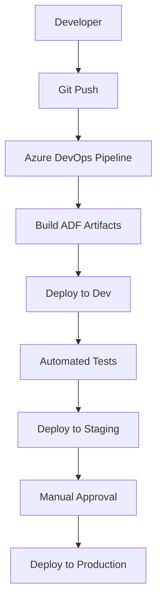

### Implementation Components

#### 1. ARM Template Generation
```powershell
# PowerShell script to export ARM templates
$resourceGroupName = "adf-dev-rg"
$dataFactoryName = "adf-dev-factory"
$armTemplateFolder = "./arm-templates"

Export-AzResourceGroup `
    -ResourceGroupName $resourceGroupName `
    -Resource "/subscriptions/.../resourceGroups/$resourceGroupName/providers/Microsoft.DataFactory/factories/$dataFactoryName" `
    -Path $armTemplateFolder `
    -Force
```

#### 2. Azure DevOps Pipeline
```yaml
# azure-pipelines.yml
trigger:
  branches:
    include:
    - main
    - develop

stages:
- stage: Build
  jobs:
  - job: BuildADF
    steps:
    - task: AzureResourceManagerTemplateDeployment@3
      inputs:
        deploymentScope: 'Resource Group'
        azureResourceManagerConnection: 'Azure-DevOps-Service-Connection'
        subscriptionId: '$(subscriptionId)'
        action: 'Create Or Update Resource Group'
        resourceGroupName: '$(resourceGroupName)'
        location: '$(location)'
        templateLocation: 'Linked artifact'
        csmFile: '$(System.DefaultWorkingDirectory)/arm-templates/template.json'
        csmParametersFile: '$(System.DefaultWorkingDirectory)/arm-templates/parameters.json'
        overrideParameters: >
          -factoryName "$(factoryName)"
          -environment "$(environment)"

- stage: Test
  condition: and(succeeded(), eq(variables['Build.SourceBranch'], 'refs/heads/develop'))
  jobs:
  - job: IntegrationTests
    steps:
    - task: AzureCLI@2
      inputs:
        azureSubscription: 'Azure-DevOps-Service-Connection'
        scriptType: 'bash'
        scriptLocation: 'inlineScript'
        inlineScript: |
          # Run integration tests
          echo "Running ADF integration tests..."

- stage: DeployStaging
  condition: and(succeeded(), eq(variables['Build.SourceBranch'], 'refs/heads/main'))
  jobs:
  - deployment: DeployStaging
    environment: 'staging'
    strategy:
      runOnce:
        deploy:
          steps:
          - task: AzureResourceManagerTemplateDeployment@3
            inputs:
              deploymentScope: 'Resource Group'
              azureResourceManagerConnection: 'Azure-Staging-Service-Connection'
              subscriptionId: '$(stagingSubscriptionId)'
              action: 'Create Or Update Resource Group'
              resourceGroupName: '$(stagingResourceGroupName)'
              location: '$(location)'
              templateLocation: 'Linked artifact'
              csmFile: '$(System.DefaultWorkingDirectory)/arm-templates/template.json'
              csmParametersFile: '$(System.DefaultWorkingDirectory)/arm-templates/parameters-staging.json'

- stage: DeployProduction
  condition: and(succeeded(), eq(variables['Build.SourceBranch'], 'refs/heads/main'))
  jobs:
  - deployment: DeployProduction
    environment: 'production'
    strategy:
      runOnce:
        deploy:
          steps:
          - task: AzureResourceManagerTemplateDeployment@3
            inputs:
              deploymentScope: 'Resource Group'
              azureResourceManagerConnection: 'Azure-Prod-Service-Connection'
              subscriptionId: '$(prodSubscriptionId)'
              action: 'Create Or Update Resource Group'
              resourceGroupName: '$(prodResourceGroupName)'
              location: '$(location)'
              templateLocation: 'Linked artifact'
              csmFile: '$(System.DefaultWorkingDirectory)/arm-templates/template.json'
              csmParametersFile: '$(System.DefaultWorkingDirectory)/arm-templates/parameters-prod.json'
```

#### 3. Parameter Files for Different Environments
```json
// parameters-dev.json
{
  "$schema": "https://schema.management.azure.com/schemas/2019-04-01/deploymentParameters.json#",
  "contentVersion": "1.0.0.0",
  "parameters": {
    "factoryName": {
      "value": "adf-dev-datafactory"
    },
    "LS_SQL_connectionString": {
      "value": "Server=tcp:dev-sql-server.database.windows.net,1433;Database=dev-db;"
    },
    "LS_Blob_connectionString": {
      "value": "DefaultEndpointsProtocol=https;AccountName=devstorage;AccountKey=...;"
    }
  }
}
```

## Best Practices for End-to-End Projects

### Project Planning
1. **Requirements Gathering**: Understand business needs and technical constraints
2. **Architecture Design**: Design scalable and maintainable solutions
3. **Data Modeling**: Plan data structures and relationships
4. **Security Planning**: Implement appropriate security measures

### Development Best Practices
1. **Modular Design**: Break complex pipelines into reusable components
2. **Error Handling**: Implement comprehensive error handling and logging
3. **Testing Strategy**: Unit tests, integration tests, and performance tests
4. **Documentation**: Maintain detailed documentation for maintenance

### Deployment Best Practices
1. **Environment Strategy**: Dev → Staging → Production progression
2. **CI/CD Pipeline**: Automated testing and deployment
3. **Configuration Management**: Environment-specific configurations
4. **Rollback Strategy**: Ability to quickly rollback changes

### Monitoring and Maintenance
1. **Monitoring Setup**: Comprehensive monitoring and alerting
2. **Performance Tuning**: Regular performance optimization
3. **Security Updates**: Keep components up to date
4. **Documentation Updates**: Maintain current documentation

---

# 46. Best Practices

## Development Best Practices

* Use naming conventions
* Use parameterization
* Avoid hardcoding
* Implement logging
* Use reusable pipelines
* Use Git integration
* Enable monitoring

## Performance Best Practices

* Use partitioning
* Use incremental load
* Optimize data flows
* Use staging carefully

---

# 47. Common Interview Questions

## Beginner Level

1. What is Azure Data Factory?
2. What is Integration Runtime?
3. Difference between dataset and linked service?
4. What is a pipeline?
5. What are triggers?

## Intermediate Level

1. Explain incremental loading.
2. Difference between ETL and ELT?
3. Explain mapping data flow.
4. How does self-hosted IR work?
5. Explain parameterization.

## Advanced Level

1. How to optimize ADF performance?
2. Explain CI/CD in ADF.
3. How to handle pipeline failures?
4. Explain dynamic content.
5. How to secure ADF pipelines?

---

# 48. ADF Developer Roadmap

# Phase 1: Basics

* Azure basics
* Cloud concepts
* Storage concepts
* SQL fundamentals

# Phase 2: ADF Fundamentals

* Pipelines
* Activities
* Datasets
* Linked services
* Triggers

# Phase 3: Intermediate

* Data flow
* Dynamic content
* Incremental load
* API integration
* Error handling

# Phase 4: Advanced

* CI/CD
* Databricks integration
* Synapse integration
* Security
* Performance tuning

# Phase 5: Real Projects

* End-to-end projects
* Production scenarios
* Monitoring implementation

---

# 49. ADF Naming Standards

## Recommended Naming Conventions

| Component      | Naming Example     |
| -------------- | ------------------ |
| Pipeline       | PL_Copy_Customer   |
| Dataset        | DS_SQL_Employee    |
| Linked Service | LS_SQL_Server      |
| Trigger        | TR_Daily_Load      |
| Data Flow      | DF_Transform_Sales |

---

# 50. Important Terminologies

| Term  | Meaning                           |
| ----- | --------------------------------- |
| ETL   | Extract Transform Load            |
| ELT   | Extract Load Transform            |
| IR    | Integration Runtime               |
| CDC   | Change Data Capture               |
| DIU   | Data Integration Unit             |
| RBAC  | Role-Based Access Control         |
| CI/CD | Continuous Integration/Deployment |

---

# 53. Troubleshooting and Common Issues

## Pipeline Execution Issues

### Issue: Pipeline Runs But Activities Fail

**Symptoms:**
- Pipeline status shows "Succeeded" but activities fail
- Inconsistent execution results
- Activities show "Skipped" status

**Possible Causes:**
1. **Dependency Conditions**: Incorrect dependency configuration
2. **Error Handling**: Activities set to continue on failure
3. **Trigger Configuration**: Trigger not properly configured

**Solutions:**
```json
// Check dependency conditions
"dependsOn": [
  {
    "activity": "CopyData",
    "dependencyConditions": ["Succeeded"]  // Change to ["Completed"] if needed
  }
]

// Enable proper error propagation
"policy": {
  "timeout": "01:00:00",
  "retry": 3,
  "retryIntervalInSeconds": 30
}
```

### Issue: Copy Activity Performance Degradation

**Symptoms:**
- Copy jobs taking longer than expected
- High DIU usage but slow throughput
- Pipeline timeouts

**Troubleshooting Steps:**
1. **Check DIU Usage**: Monitor Data Integration Unit consumption
2. **Review Source/Target**: Check if source or target is bottleneck
3. **Examine Data Skew**: Look for uneven data distribution
4. **Verify Network**: Check network bandwidth and latency

**Optimization Solutions:**
```json
// Increase parallel copies
"typeProperties": {
  "parallelCopies": 8,
  "dataIntegrationUnits": 32
}

// Use staging for cross-region transfers
"enableStaging": true,
"stagingSettings": {
  "linkedServiceName": {
    "referenceName": "LS_StagingStorage"
  }
}
```

## Connection and Authentication Issues

### Issue: Linked Service Connection Failures

**Common Error Messages:**
- "Login failed for user"
- "Cannot open server connection"
- "Access denied"

**Troubleshooting Checklist:**
1. **Credentials Validation**: Verify username/password or keys
2. **Firewall Rules**: Check if ADF IP ranges are whitelisted
3. **Network Connectivity**: Test connection from ADF region
4. **Permissions**: Ensure proper database/object permissions

**Resolution Examples:**
```json
// For Azure SQL Database
{
  "type": "AzureSqlDatabase",
  "typeProperties": {
    "connectionString": "Server=tcp:server.database.windows.net,1433;Database=db;Authentication=Active Directory Password;Encrypt=True;",
    "password": {
      "type": "AzureKeyVaultSecret",
      "store": {
        "referenceName": "LS_KeyVault"
      },
      "secretName": "sql-password"
    }
  }
}
```

### Issue: Self-Hosted IR Connectivity Problems

**Symptoms:**
- IR shows "Offline" status
- Pipeline fails with connectivity errors
- Intermittent connection issues

**Diagnostic Steps:**
1. **IR Service Status**: Check if SHIR service is running
2. **Network Configuration**: Verify firewall and proxy settings
3. **DNS Resolution**: Test DNS resolution from SHIR machine
4. **Port Availability**: Ensure required ports are open

**Configuration Fixes:**
```json
// SHIR configuration
{
  "name": "SHIR_OnPrem",
  "type": "SelfHosted",
  "typeProperties": {
    "linkedInfos": [
      {
        "name": "OnPremSqlServer",
        "type": "SqlServer",
        "typeProperties": {
          "connectionString": "Server=sqlserver.company.com;Database=ProdDB;",
          "userName": "adf_user",
          "password": {
            "type": "SecureString",
            "value": "***"
          }
        }
      }
    ]
  }
}
```

## Data Flow Issues

### Issue: Data Flow Cluster Startup Failures

**Symptoms:**
- Data flow fails with cluster creation errors
- Long startup times
- Out of memory errors

**Solutions:**
```json
// Optimize cluster configuration
{
  "typeProperties": {
    "compute": {
      "coreCount": 8,
      "computeType": "General"
    },
    "timeToLive": 10
  }
}
```

### Issue: Data Skew and Performance Issues

**Symptoms:**
- Uneven data distribution across partitions
- Some partitions processing much slower
- Memory pressure on certain nodes

**Optimization Techniques:**
```json
// Implement proper partitioning
{
  "partitioning": {
    "type": "Hash",
    "partitionColumnName": "customer_id"
  }
}

// Use broadcast join for small tables
{
  "join": {
    "type": "Broadcast"
  }
}
```

## Trigger and Scheduling Issues

### Issue: Triggers Not Firing

**Symptoms:**
- Scheduled pipelines not executing
- Event-based triggers not responding
- Tumbling window triggers missing data

**Diagnostic Queries:**
```sql
-- Check trigger runs in ADF monitoring
SELECT * FROM dbo.TriggerRuns
WHERE TriggerName = 'MyTrigger'
ORDER BY RunStart DESC

-- Check for trigger failures
SELECT * FROM dbo.ActivityRuns
WHERE PipelineName = 'MyPipeline'
AND Status = 'Failed'
```

**Common Fixes:**
```json
// Fix schedule trigger timezone issues
{
  "type": "ScheduleTrigger",
  "typeProperties": {
    "recurrence": {
      "frequency": "Day",
      "interval": 1,
      "startTime": "2024-01-01T06:00:00Z",
      "timeZone": "UTC"
    }
  }
}
```

## Memory and Resource Issues

### Issue: Out of Memory Errors

**Symptoms:**
- Pipeline fails with OOM errors
- Data flow cluster crashes
- Activities timeout unexpectedly

**Memory Optimization:**
```json
// Increase cluster size for data flows
{
  "compute": {
    "coreCount": 16,
    "computeType": "MemoryOptimized"
  }
}

// Implement paging for large datasets
{
  "source": {
    "type": "SqlServerSource",
    "isolationLevel": "ReadUncommitted",
    "partitionOption": "DynamicRange",
    "partitionSettings": {
      "partitionColumnName": "id",
      "partitionUpperBound": "1000000",
      "partitionLowerBound": "1"
    }
  }
}
```

## Debugging Techniques

### Using Debug Mode

```json
// Enable debug mode for pipelines
{
  "debug": true,
  "parameters": {
    "debugDataset": {
      "value": "DS_Debug_Output"
    }
  }
}
```

### Logging Best Practices

```json
// Implement comprehensive logging
{
  "activities": [
    {
      "name": "Log_Start",
      "type": "SetVariable",
      "typeProperties": {
        "variableName": "ExecutionLog",
        "value": "@concat('Pipeline started at: ', utcnow())"
      }
    },
    {
      "name": "Log_Activity_Result",
      "type": "AppendVariable",
      "typeProperties": {
        "variableName": "ExecutionLog",
        "value": "@concat(activity('CopyData').output.rowsCopied, ' rows copied')"
      }
    }
  ]
}
```

### Monitoring Queries

```sql
-- Pipeline performance monitoring
SELECT
    PipelineName,
    AVG(DurationInMs) as AvgDuration,
    MAX(DurationInMs) as MaxDuration,
    COUNT(*) as TotalRuns,
    SUM(CASE WHEN Status = 'Failed' THEN 1 ELSE 0 END) as FailedRuns
FROM dbo.PipelineRuns
WHERE RunStart > DATEADD(day, -30, GETDATE())
GROUP BY PipelineName
ORDER BY AvgDuration DESC

-- Activity error analysis
SELECT
    ActivityName,
    ErrorMessage,
    COUNT(*) as ErrorCount,
    MAX(RunStart) as LastError
FROM dbo.ActivityRuns
WHERE Status = 'Failed'
AND RunStart > DATEADD(day, -7, GETDATE())
GROUP BY ActivityName, ErrorMessage
ORDER BY ErrorCount DESC
```

## Performance Tuning Checklist

### Data Movement Optimization
- [ ] Use appropriate DIU settings
- [ ] Enable parallel copying
- [ ] Implement data partitioning
- [ ] Use staging for large transfers
- [ ] Compress data when possible

### Data Flow Optimization
- [ ] Choose correct compute type
- [ ] Implement proper partitioning
- [ ] Use caching strategically
- [ ] Optimize join types
- [ ] Monitor cluster utilization

### Pipeline Optimization
- [ ] Minimize activity count
- [ ] Use parallel execution
- [ ] Implement incremental loads
- [ ] Optimize trigger schedules
- [ ] Monitor resource usage

### Infrastructure Optimization
- [ ] Choose correct IR type
- [ ] Optimize network configuration
- [ ] Implement proper security
- [ ] Monitor costs and usage
- [ ] Plan for scaling needs

---

# 52. Certification Guidance

## Recommended Certifications

### Microsoft Certifications

* DP-203: Data Engineering on Microsoft Azure
* AZ-900: Azure Fundamentals
* DP-900: Data Fundamentals

## Preparation Strategy

1. Learn basics
2. Build projects
3. Practice labs
4. Solve interview questions
5. Attempt mock tests

---

# 54. Advanced Topics and Future Trends

## Advanced ADF Features

### 1. Change Data Capture (CDC) Patterns

#### Native CDC with Azure SQL DB
```json
{
  "name": "PL_CDC_Load",
  "properties": {
    "activities": [
      {
        "name": "Get_Change_Data",
        "type": "Lookup",
        "typeProperties": {
          "source": {
            "type": "AzureSqlSource",
            "sqlReaderQuery": "
              SELECT * FROM cdc.dbo_Customers_CT
              WHERE __$start_lsn > @last_lsn
              AND __$operation IN (1, 2, 4) -- Insert, Update, Delete
              ORDER BY __$start_lsn"
          },
          "dataset": {"referenceName": "DS_SQL_Customers"}
        }
      },
      {
        "name": "Process_Changes",
        "type": "ForEach",
        "typeProperties": {
          "items": "@activity('Get_Change_Data').output.value",
          "activities": [
            {
              "name": "Route_By_Operation",
              "type": "Switch",
              "typeProperties": {
                "on": "@item().__$operation",
                "cases": {
                  "1": [{"name": "Insert_Record", "type": "Copy"}],
                  "2": [{"name": "Update_Record", "type": "Copy"}],
                  "4": [{"name": "Delete_Record", "type": "SqlServerStoredProcedure"}]
                }
              }
            }
          ]
        }
      }
    ]
  }
}
```

#### Custom CDC Implementation
```sql
-- Watermark table for custom CDC
CREATE TABLE dbo.CDC_Watermark (
    TableName VARCHAR(100) PRIMARY KEY,
    LastLSN BINARY(10),
    LastProcessedDate DATETIME2
);

-- Incremental load with custom logic
SELECT *
FROM Customers
WHERE LastModifiedDate > (
    SELECT LastProcessedDate
    FROM dbo.CDC_Watermark
    WHERE TableName = 'Customers'
)
AND LastModifiedDate <= GETDATE();
```

### 2. Event-Driven Architectures

#### Event Grid Integration
```json
{
  "name": "TR_Event_Trigger",
  "properties": {
    "type": "BlobEventsTrigger",
    "typeProperties": {
      "blobPathBeginsWith": "/data/input/",
      "blobPathEndsWith": ".csv",
      "ignoreEmptyBlobs": true,
      "scope": "/subscriptions/.../resourceGroups/.../providers/Microsoft.Storage/storageAccounts/...",
      "events": ["Microsoft.Storage.BlobCreated"]
    },
    "pipelines": [
      {
        "pipelineReference": {
          "referenceName": "PL_Process_File",
          "type": "PipelineReference"
        },
        "parameters": {
          "fileName": "@triggerBody().fileName",
          "folderPath": "@triggerBody().folderPath"
        }
      }
    ]
  }
}
```

#### Real-Time Data Processing
```json
{
  "name": "PL_RealTime_Processing",
  "properties": {
    "activities": [
      {
        "name": "Ingest_Stream_Data",
        "type": "Copy",
        "typeProperties": {
          "source": {
            "type": "EventHubSource",
            "consumerGroupName": "$Default"
          },
          "sink": {
            "type": "SqlSink",
            "writeBehavior": "upsert"
          }
        }
      },
      {
        "name": "Trigger_Stream_Analytics",
        "type": "WebActivity",
        "typeProperties": {
          "method": "POST",
          "url": "https://management.azure.com/.../start?api-version=2016-03-01",
          "authentication": {
            "type": "MSI",
            "resource": "https://management.azure.com/"
          }
        }
      }
    ]
  }
}
```

### 3. Machine Learning Integration

#### ML Model Scoring in Data Flows
```json
{
  "name": "DF_ML_Scoring",
  "type": "MappingDataFlow",
  "typeProperties": {
    "sources": [
      {
        "name": "InputData",
        "dataset": {"referenceName": "DS_Input_Data"}
      }
    ],
    "transformations": [
      {
        "name": "Call_ML_Model",
        "type": "DerivedColumn",
        "typeProperties": {
          "columns": [
            {
              "name": "Prediction",
              "expression": "amlPredict('workspace/model', input_data)"
            }
          ]
        }
      }
    ],
    "sinks": [
      {
        "name": "ScoredData",
        "dataset": {"referenceName": "DS_Scored_Output"}
      }
    ]
  }
}
```

#### Automated ML Pipeline
```json
{
  "name": "PL_AutoML_Training",
  "properties": {
    "activities": [
      {
        "name": "Prepare_Training_Data",
        "type": "DataFlow",
        "typeProperties": {
          "dataFlow": {"referenceName": "DF_Data_Preparation"}
        }
      },
      {
        "name": "Train_ML_Model",
        "type": "AzureMLExecutePipeline",
        "typeProperties": {
          "experimentName": "Customer_Churn_Prediction",
          "mlPipelineId": "pipeline_id",
          "mlPipelineParameters": {
            "training_data": "@activity('Prepare_Training_Data').output"
          }
        }
      },
      {
        "name": "Register_Model",
        "type": "AzureMLExecutePipeline",
        "dependsOn": [
          {
            "activity": "Train_ML_Model",
            "dependencyConditions": ["Succeeded"]
          }
        ]
      }
    ]
  }
}
```

## Future Trends in ADF

### 1. AI-Powered Data Integration

#### Intelligent Mapping
- **Auto-mapping**: AI suggests column mappings based on data patterns
- **Schema Evolution**: Automatic handling of schema changes
- **Data Quality Scoring**: ML-based data quality assessment

#### Predictive Optimization
- **Auto-tuning**: AI recommends performance optimizations
- **Cost Optimization**: Intelligent resource allocation
- **Anomaly Detection**: ML-based pipeline failure prediction

### 2. Low-Code/No-Code Evolution

#### Visual Pipeline Builder
- **Drag-and-drop Enhancements**: More intuitive interface
- **Template Library**: Pre-built pipeline templates
- **Copilot Integration**: AI-assisted pipeline development

#### Citizen Integrator Features
- **Natural Language Processing**: Describe pipelines in plain English
- **Auto-generated Documentation**: Automatic pipeline documentation
- **Business User Tools**: Simplified interface for business users

### 3. Multi-Cloud and Hybrid Evolution

#### Cross-Cloud Data Movement
```json
// Future cross-cloud linked service
{
  "name": "LS_AWS_S3_CrossCloud",
  "type": "AmazonS3",
  "typeProperties": {
    "cloudType": "AWS",
    "region": "us-east-1",
    "crossCloudEnabled": true
  }
}
```

#### Unified Control Plane
- **Single Pane of Glass**: Manage all cloud resources from one interface
- **Unified Security**: Consistent security policies across clouds
- **Global Optimization**: Intelligent data placement and movement

### 4. Real-Time and Streaming Integration

#### Native Streaming Support
- **Event-Driven Pipelines**: React to events in real-time
- **Stream Processing**: Built-in stream processing capabilities
- **Change Streams**: Direct integration with database change streams

#### Advanced Analytics Integration
- **Real-Time ML Scoring**: Stream data through ML models
- **Complex Event Processing**: Pattern detection and alerting
- **Time-Series Analytics**: Built-in time-series processing

### 5. Serverless and Event-Driven Architecture

#### Serverless Execution
- **Pay-per-execution**: Only pay for actual pipeline runs
- **Auto-scaling**: Instant scaling based on workload
- **Event-driven**: Trigger pipelines based on any event

#### Microservices Integration
- **Container Support**: Run pipelines in containers
- **Kubernetes Integration**: Native K8s support
- **Service Mesh**: Advanced service-to-service communication

### 6. Advanced Security and Compliance

#### Zero-Trust Architecture
- **Continuous Verification**: Always-on security validation
- **Fine-grained Access**: Row-level and column-level security
- **Data Masking**: Automatic PII detection and masking

#### Compliance Automation
- **Audit Automation**: Automated compliance reporting
- **Data Lineage**: End-to-end data tracking
- **Retention Policies**: Automated data lifecycle management

### 7. Industry-Specific Solutions

#### Healthcare Data Integration
- **FHIR Integration**: Native Fast Healthcare Interoperability Resources support
- **HIPAA Compliance**: Built-in healthcare compliance features
- **Patient Data Lakes**: Specialized healthcare data architectures

#### Financial Services
- **Regulatory Reporting**: Automated regulatory compliance
- **Risk Analytics**: Real-time risk assessment pipelines
- **Trade Surveillance**: Automated trade monitoring and alerting

### 8. Sustainability and Green Computing

#### Carbon-Aware Computing
- **Green Scheduling**: Schedule jobs during low-carbon periods
- **Energy Optimization**: Optimize resource usage for energy efficiency
- **Carbon Tracking**: Monitor and report carbon footprint

#### Sustainable Architecture
- **Edge Computing**: Process data closer to source to reduce network traffic
- **Efficient Storage**: Optimize storage patterns for energy efficiency
- **Workload Consolidation**: Intelligent workload placement

## Preparing for Future ADF

### Skills Development Roadmap

#### Phase 1: Current Skills (2024-2025)
- Master current ADF features
- Learn advanced data flow patterns
- Understand security and compliance

#### Phase 2: Emerging Skills (2025-2026)
- AI/ML integration patterns
- Multi-cloud architectures
- Real-time data processing

#### Phase 3: Future Skills (2026-2027)
- Event-driven architectures
- Serverless data integration
- Sustainable data practices

### Technology Adoption Strategy

#### Pilot Programs
- Start with small, low-risk projects
- Test new features in development environments
- Gather feedback and metrics

#### Gradual Migration
- Migrate existing pipelines incrementally
- Use feature flags for new capabilities
- Maintain backward compatibility

#### Continuous Learning
- Follow ADF release notes and blogs
- Participate in preview programs
- Join ADF user communities

### Organizational Readiness

#### Team Skills Assessment
- Evaluate current team capabilities
- Identify skill gaps
- Plan training and certification programs

#### Process Adaptation
- Update development processes
- Modify testing strategies
- Enhance monitoring and alerting

#### Governance Framework
- Update data governance policies
- Enhance security frameworks
- Modify compliance procedures

## Conclusion

Azure Data Factory continues to evolve rapidly, incorporating the latest trends in data integration, AI/ML, and cloud computing. By staying current with these trends and preparing for future developments, organizations can maximize their investment in ADF and maintain a competitive edge in data integration.

Key takeaways for future readiness:
1. **Embrace AI/ML Integration**: Learn to incorporate machine learning into data pipelines
2. **Adopt Event-Driven Patterns**: Move from batch to real-time processing
3. **Plan for Multi-Cloud**: Design architectures that span multiple cloud providers
4. **Focus on Sustainability**: Consider environmental impact in data architecture decisions
5. **Invest in Skills**: Continuously update team skills and knowledge
6. **Stay Current**: Follow ADF developments and adopt new features strategically

# 54. Conclusion

Azure Data Factory is one of the most important cloud data integration tools for Data Engineers.

ADF helps organizations:

* Automate workflows
* Move large-scale data
* Build ETL/ELT pipelines
* Integrate multiple systems
* Create scalable cloud architectures

To become strong in ADF:

1. Learn fundamentals properly
2. Build hands-on projects
3. Practice real scenarios
4. Understand cloud concepts
5. Learn SQL deeply
6. Work on incremental loading
7. Understand monitoring and security

ADF combined with:

* SQL
* Python
* PySpark
* Synapse
* Databricks

creates a strong Data Engineering skill set.

---

# Final Learning Sequence

1. Azure Basics
2. SQL Fundamentals
3. Azure Storage
4. Azure Data Factory Basics
5. Pipelines
6. Activities
7. Triggers
8. Dynamic Content
9. Data Flow
10. Incremental Load
11. Error Handling
12. Monitoring
13. Git Integration
14. CI/CD
15. Synapse
16. Databricks
17. End-to-End Projects
18. Interview Preparation
19. Certification
20. Production-Level Architecture
